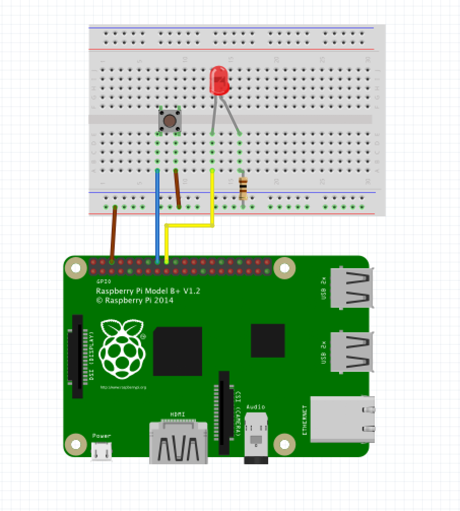

# Pushing the button

In this step we'll be using python to send and receive output/input to and from the Pi's. We'll later use this to trigger certain scripts to take control of the drone. 

## GPIO Pins

The Pi's comes equipped with a number of GPIO pins (general-purpose input/output) located along the top edge of the board. Any of the GPIO pins can be designated as an input or output pin and used for a wide range of purposes.


Note: the numbering of the GPIO pins is not in numerical order.

## Schematics

You have received a small number of parts for this project, namely: 

* 2 push buttons
* 2 100ohm resistors
* 2 leds
* assorted set of jumper wires
* bread board
* Raspberry Pi 3 B+ w/Raspbian OS

We'll start by connecting about half of them in this step and try to make one of the led's light up when we push a button.

Following the circuit diagram bellow start by connecting the parts to the board and Pi.



Once done head over to your favorite terminal again and connect to the Pi.

## Deploy/Run/Test

Connect to the Pi and run the following command to create a folder for the src files.

``` bash

ᐅ ssh pi@raspberrypi.local

pi@raspberrypi.local`s password: 

pi@raspberrypi:~ $ mkdir drone-hack

pi@raspberrypi:~ $ cd drone-hack

```

Use your favorite terminal based editor (vim/nano etc) and create a file called step1.py (or give it any other name you see fit)

``` bash

pi@raspberrypi:~/drone-hack $ nano step1.py

```

Paste the bellow [content](###Le-Code) into the file and save it!

Run the program and try pushing the button. The led should light up and the program should print 'Button Pressed...' to the console.

``` bash 

pi@raspberrypi:~/drone-hack $ python3 step1.py 
Button Pressed...

```

Well done, grab some covfefe and get cracking on [step2](step2.md)

### Le Code

``` Python

import RPi.GPIO as GPIO
import time

GPIO.setmode(GPIO.BCM)

GPIO.setup(23, GPIO.IN, pull_up_down=GPIO.PUD_UP) #Button to GPIO23
GPIO.setup(24, GPIO.OUT)  #LED to GPIO24

try:
    while True:
         button_state = GPIO.input(23)
         if button_state == False:
             GPIO.output(24, True)
             print('Button Pressed...')
             time.sleep(0.2)
         else:
             GPIO.output(24, False)
except:
    GPIO.cleanup()


```

