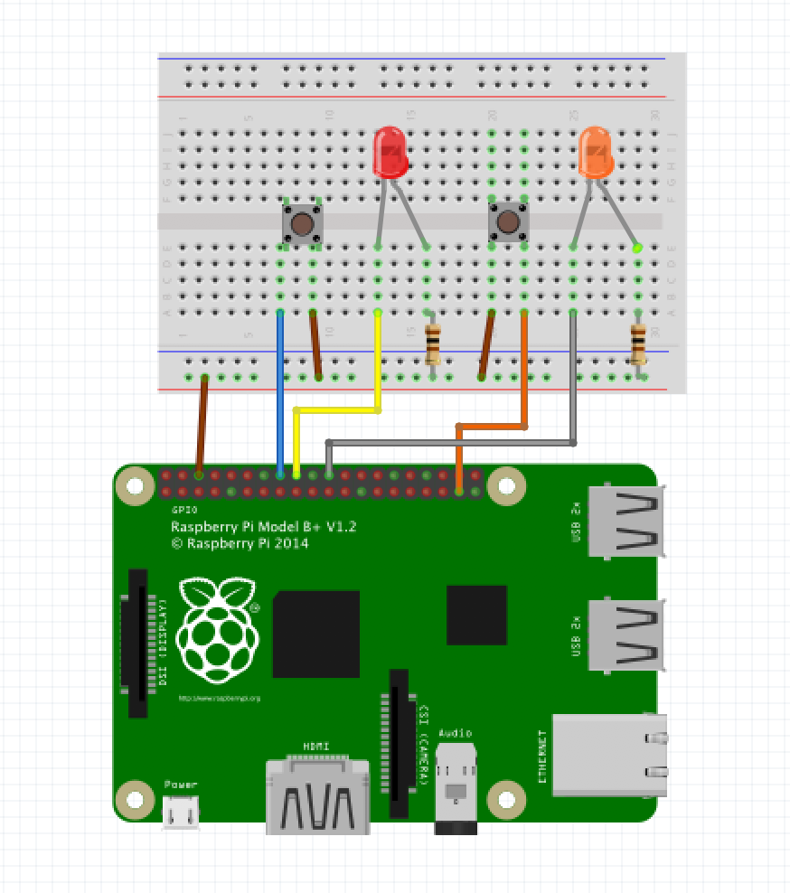

# Brick by brick

Now that we've successfully utilized the GPIO pins to receive input from a button we can use this technique to trigger different actions on the Pi. But first; lets...

## Add the remaining parts

Adding a second button let's us trigger two different actions at different times. This will make sense later as we might need two steps to kill off the drone.



## Updating our program

Since we've just added a second button and LED, we need to update our program to reflect that.

In a new file (step2.py for instance) paste the [code bellow](#codezz).  

```Bash

pi@raspberrypi:~/drone-hack $ nano step2.py

```


#### codezz

``` Python 

import RPi.GPIO as GPIO
import time

GPIO.setmode(GPIO.BCM)
GPIO.setup(23, GPIO.IN, pull_up_down=GPIO.PUD_UP) # First Button to GPIO23
GPIO.setup(24, GPIO.OUT)  # First LED to GPIO24

GPIO.setup(25, GPIO.OUT)  # Second LED to GPIO25
GPIO.setup(26, GPIO.IN, pull_up_down=GPIO.PUD_UP) # Second Button to GPIO26

def PushButton():
    try:
        while True:
             button1 = GPIO.input(23)
             button2 = GPIO.input(26)
             if button1 == False:
                 GPIO.output(24, True)
                 print('Button 1 Pressed...')
                 time.sleep(0.2)                 
             elif button2 == False:
                 GPIO.output(25, True)
                 print('Button 2 Pressed...')
                 time.sleep(0.2)
             else:
                 GPIO.output(24, False)
                 GPIO.output(25, False)
    except:
        print('Error')
        GPIO.cleanup()
        
PushButton()

```


