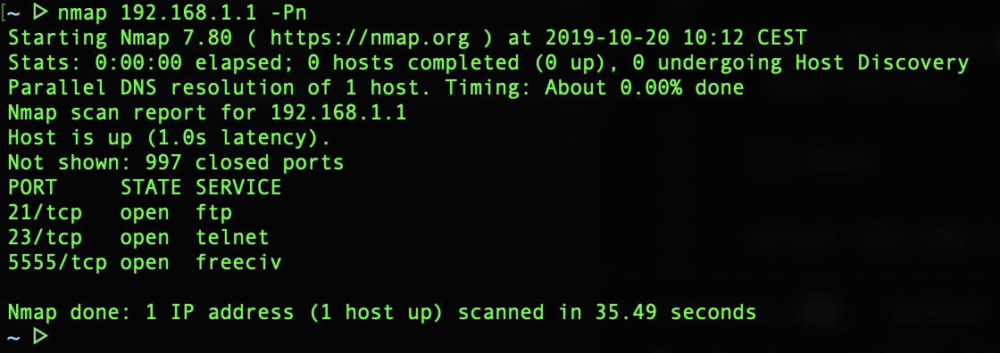
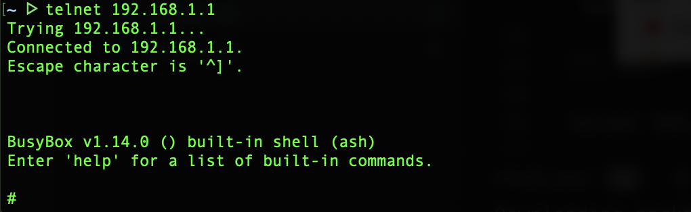
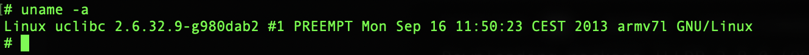
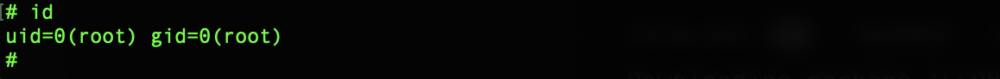

# Hacking

We now have all the necessary pieces required for our little drone killer, and we're ready to get to work on the drone. First of is discovering the vulnerability and secondly exploiting it. This can be done on our computers, but we'll use the result to update our program running on the Pi.

## Discovering the vulnerability

The drone uses WiFi to connect to a phone, or pad, and lets the user control the drone through an app. Turning on the drone; navigate over to your computers network tab and look for a new wireless network to appear, take note of the network name (SSID) and try to connect to the network.

Once connected run nmap to scan for any open ports on the drone/network.

```Bash

nmap 192.168.1.1 -Pn

```

After some time you should se something like the output bellow.



Neat! The drone has a telnet service listening on port 23, lets try it..

``` Bash

telnet 192.168.1.1

```




We're in! Lets find out our user privileges and what kind of OS is running by running uname and id.

``` Bash

uname -a

```



```Bash

id

```




Awesome, the drone is running linux and we even have root access! At this point we could simply issue a `shutdown now` and watch the drone fall down, and that's exactly what we'll do in the final step!


